## Tên đề tài: Xây dựng ứng dụng bán máy tính
## Giới thiệu hệ thống
**Daevalok Tech** là giải pháp ứng dụng di động thương mại điện tử chuyên biệt cho lĩnh vực kinh doanh laptop và phụ kiện công nghệ. Ứng dụng được xây dựng trên nền tảng di động tiên tiến, tối ưu hóa trải nghiệm người dùng (UI/UX) giúp việc tìm kiếm cấu hình, so sánh giá cả và đặt hàng trở nên nhanh chóng, mượt mà.

### Các tính năng cốt lõi của hệ thống:
* **Xác thực người dùng:** Đăng nhập, đăng ký tài khoản hệ thống động, quản lý thông tin profile.
* **Khám phá sản phẩm:** Giao diện trang chủ hiển thị danh mục laptop phân loại theo hãng, cấu hình (Specs), bộ lọc tìm kiếm thông minh.
* **Giỏ hàng toàn diện (Cart):** Thêm, bớt, cập nhật số lượng sản phẩm trực tiếp, tự động tính toán tổng tiền theo thời gian thực.
* **Danh sách yêu thích (Favorites):** Thả tim lưu trữ sản phẩm quan tâm, hỗ trợ chuyển nhanh toàn bộ list yêu thích vào giỏ hàng.
* **Thanh toán giả lập (Checkout Process):** Hỗ trợ nhiều phương thức (COD, Ví MoMo, VNPay), có màn hình xử lý giao dịch ngầm chống rò rỉ bộ nhớ (Memory Leak) và xử lý luồng hủy giao dịch chuẩn thực tế.
* **Lịch sử đơn hàng (Orders History):** Quản lý trạng thái và lưu trữ danh sách các hóa đơn đã giao dịch thành công.

---

## Danh sách thành viên & Phân công nhiệm vụ

- **Họ và tên:** Trần Đại Hiệp
- **Mã sinh viên:** 21810310632
- **Phân công nhiệm vụ** Code chính, Xây dựng hệ thống, thiết kế giao diện, Hoàn thiện hệ thống, báo cáo, hoàn thiện layout, thiết kế logo, thiết kế thanh toán, thiết kế lịch sử, trang tìm kiếm, trang chủ.

- **Họ và tên:** Vũ Đăng Tùng
- **Mã sinh viên:** 21810310537
- **Phân công nhiệm vụ** Tìm kiếm các nội dung, thiết kế trang chi tiết sản phẩm, trang yêu thích, báo cáo, quay demo.
---

## Công nghệ sử dụng
Ứng dụng được triển khai bằng các công nghệ Front-end di động hiện đại và tối ưu:
* **Framework chính:** React Native v0.7x + Hệ sinh thái **Expo (SDK 51)** giúp tối ưu hóa đa nền tảng (Android & iOS).
* **Ngôn ngữ lập trình:** **TypeScript (TSX)** bảo đảm chặt chẽ về mặt kiểu dữ liệu và hạn chế lỗi runtime.
* **Cơ chế điều hướng (Navigation):** **Expo Router** ứng dụng kiến trúc *File-based Routing* tân tiến tương tự Next.js.
* **Quản lý dữ liệu cục bộ:** **`@react-native-async-storage/async-storage`** gánh toàn bộ luồng lưu trữ giỏ hàng, user session, favorites và hóa đơn không qua server.
* **Tối ưu hiệu năng:** Cấu trúc vòng đời qua các React Hooks chuyên sâu (`useState`, `useEffect`, `useRef`, `useCallback`) kết hợp **`useFocusEffect`** để nạp lại dữ liệu động tức thì khi chuyển Tab.

---

## Hướng dẫn cài đặt & Chạy project dưới Local
## Các bước cài đặt
Bật Terminal (hoặc Command Prompt) tại thư mục dự án và chạy các lệnh sau:
 Bước 1: Cài đặt toàn bộ các thư viện phụ thuộc (node_modules)
            npm install

 Bước 2: Đồng bộ và sửa các lỗi lệch phiên bản cấu hình thư viện của Expo (nếu có)
            npx expo install --fix
Để khởi chạy ứng dụng kết nối trực tiếp với điện thoại, sử dụng lệnh xóa bộ nhớ đệm và tạo đường hầm kết nối:
            npx expo start -c --tunnel

Sau khi server Metro Bundler khởi chạy thành công:

Mở ứng dụng Expo Go trên điện thoại di động của bạn.

Dùng camera điện thoại (iOS) hoặc tính năng quét mã QR trong Expo Go (Android) để quét mã QR hiển thị trên màn hình máy tính.

Chờ ứng dụng đóng gói dữ liệu (Bundle) trong vài giây và trải nghiệm hệ thống.

## Tài khoản Demo dùng thử
Hệ thống tích hợp luồng đăng nhập động giả lập, có thể nhập tài khoản bất kỳ để test hệ thống

## Hình ảnh minh họa hệ thống
 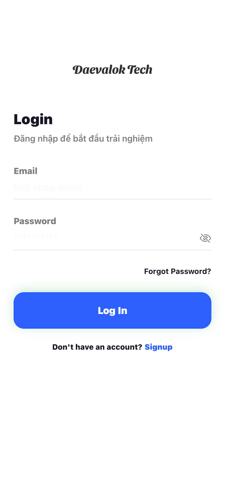 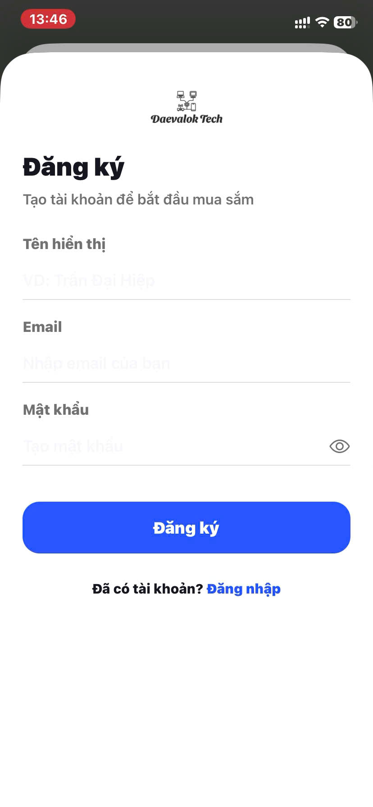    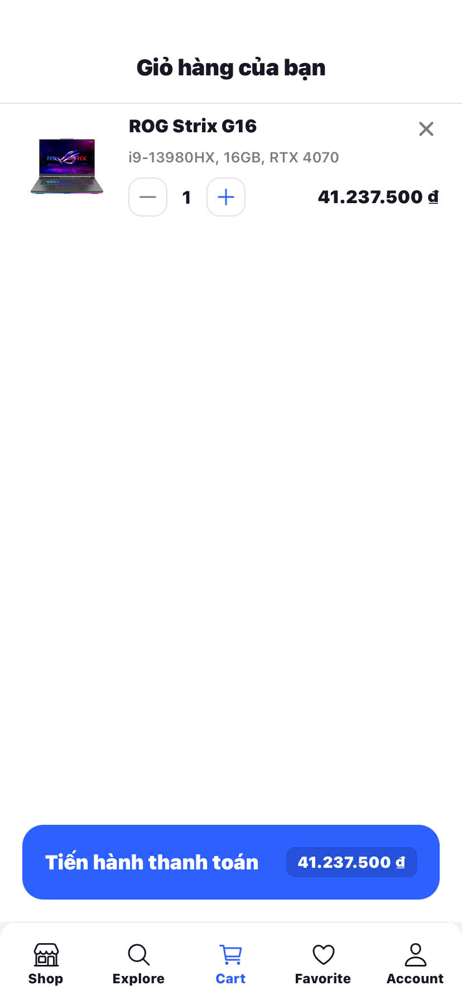 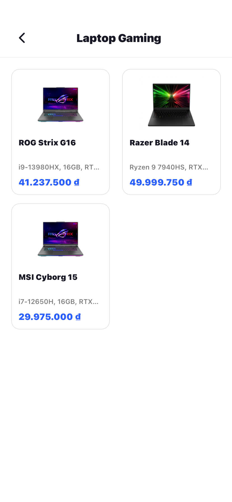 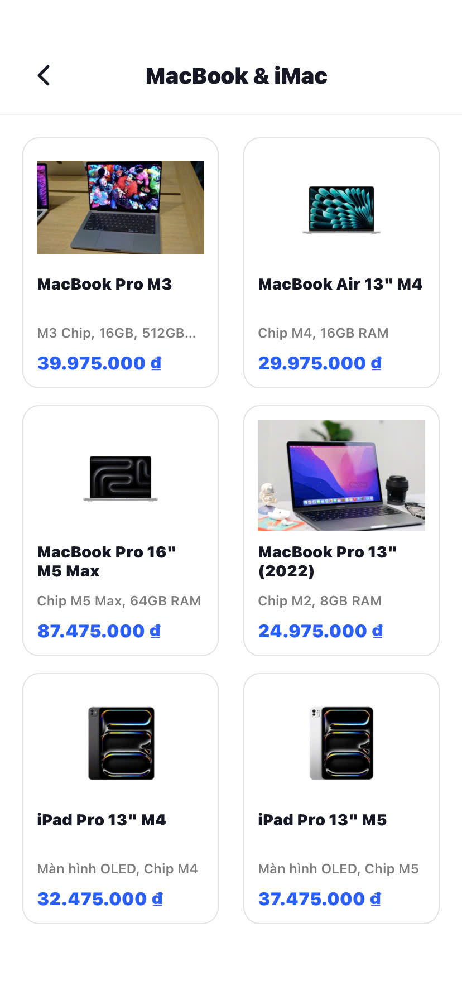 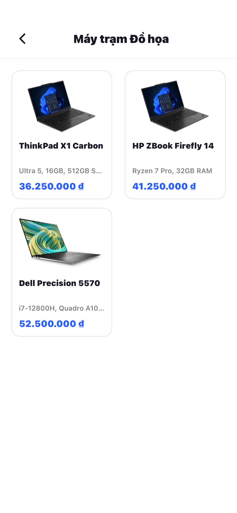 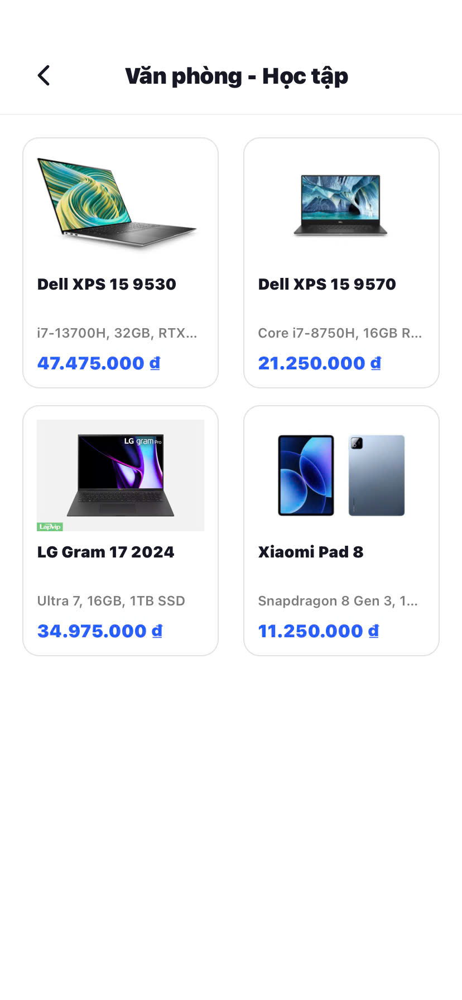 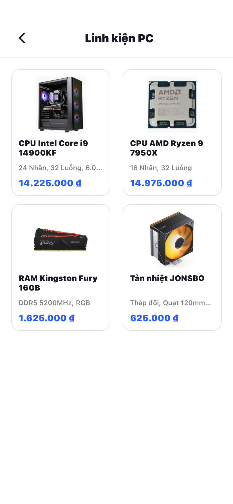 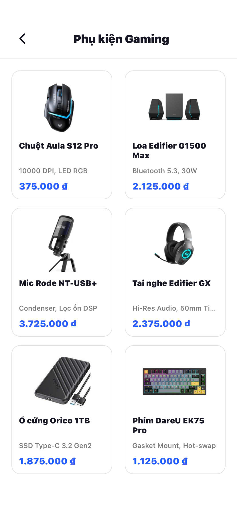  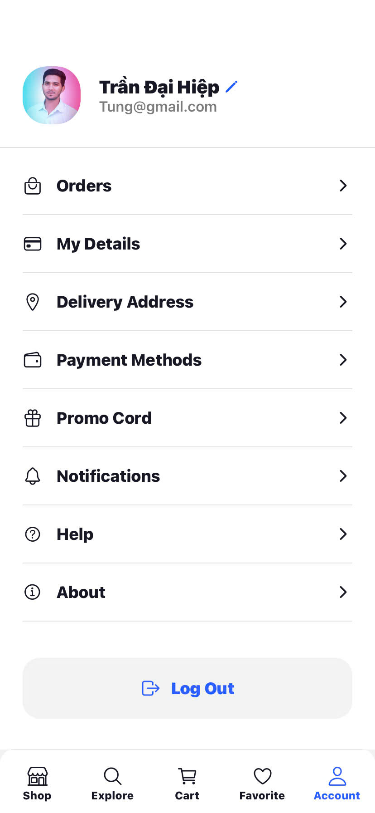 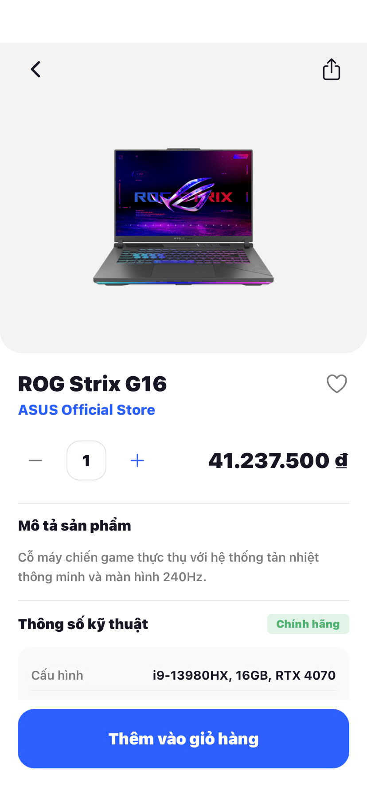  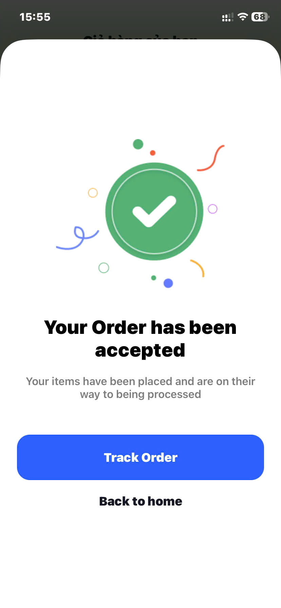 [alt text](README.md)